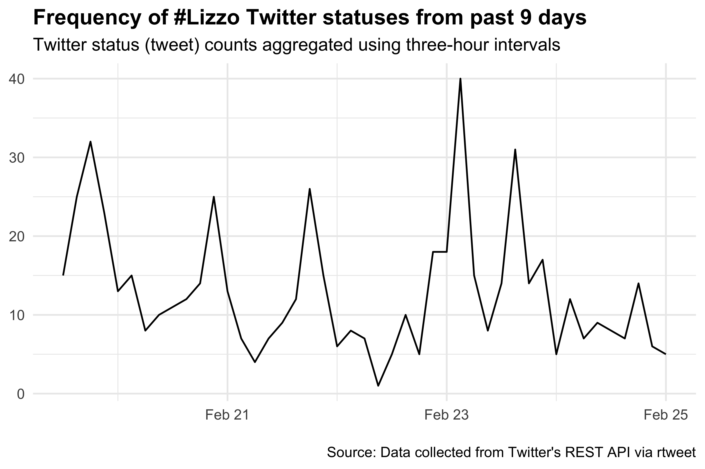
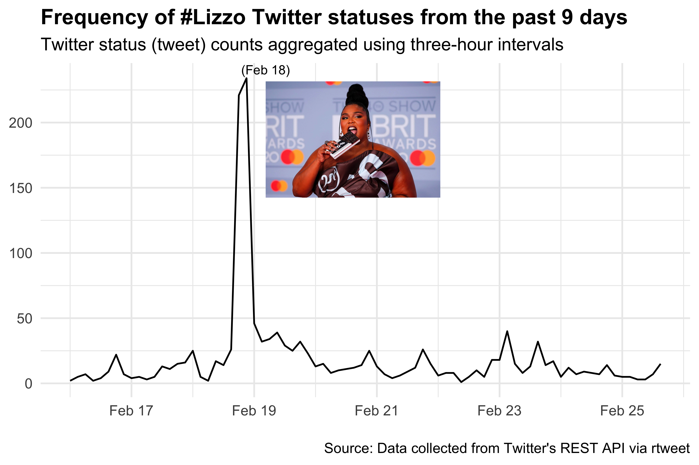
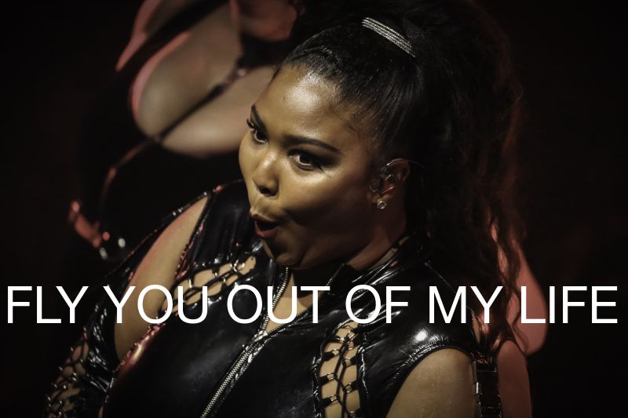

Lizzo has had a meteoric rise of success with her album Cuz I Love you.  I remember hearing "Truth Hurts" and being immediately hooked last summer when I served as a SROP mentor for undergraduate research students on campus.  I decided to create an interesting blog post to analyze tweets with the `#lizzo` hashtag, do sentiment analysis on Cuz I Love you and even generate Lizzo lyrics by making our own Markov chain generator! 

```{r message=FALSE, paged.print=FALSE}
library(kableExtra)
library(tidyverse) 
library(tidytext)
library(genius)
library(rtweet)
```

We can use the [rtweet](https://rtweet.info/) package by Michael Kearney to access Twitter's API to query tweets.
```{r eval=FALSE, include=TRUE}
Ltweet <- search_tweets(
  "#lizzo", n = 10000, include_rts = FALSE
)

Ltweet
```


```{r eval=FALSE, include=FALSE}
write_rds(Ltweet,here::here("data_files/Ltweet.rds"))
```

```{r eval=FALSE, include=FALSE}
read_rds(here::here("data_files/Ltweet.rds")) 
```


```{r eval=FALSE, include=FALSE}
library(magick)
Lizzo_BRIT<- image_read('featured.jpg') %>% 
  image_scale("800") 

print(Lizzo_BRIT)
```

```{r eval=FALSE, include=TRUE}
Ltweet %>%
  ts_plot("3 hours") +
  theme_minimal() +
  theme(plot.title = element_text(face = "bold")) +
 labs(
    x = NULL, y = NULL,
    title = "Frequency of #Lizzo Twitter statuses from the past 9 days",
    subtitle = "Twitter status (tweet) counts aggregated using three-hour intervals",
    caption = "\nSource: Data collected from Twitter's REST API via rtweet") +
  cowplot::draw_image("featured.jpg",  scale = 0.3)

```
```{r eval=FALSE, include=FALSE}
# ggsave(plot = Lizzo_plot, "Lizzo_tweet_plot.png", dpi = 600, units = "in", width = 6, height = 4)
```

  


We can see that there is a peak on February 18th, 2020 which corresponds to the 2020 BRIT awards.  Let's see if we can use [cowplot package](https://wilkelab.org/cowplot/index.html) from Claus Wilke to add a picture of Lizzo at the BRIT awards.


```{r eval=FALSE, include=FALSE}
Lizzo_plot <- Ltweet %>%
  ts_plot("3 hours") +
  theme_minimal() +
  theme(plot.title = element_text(face = "bold")) +
  ggplot2::labs(
    x = NULL, y = NULL,
    title = "Frequency of #Lizzo Twitter statuses from the past 9 days",
    subtitle = "Twitter status (tweet) counts aggregated using three-hour intervals",
    caption = "\nSource: Data collected from Twitter's REST API via rtweet"
  )
Lizzo_plot

library(cowplot)
Lizzo_BRIT_plot <- ggdraw() +
 draw_plot(Lizzo_plot) +
  draw_image("featured.jpg", hjust = -0.005, vjust = -0.2, scale = .25) +
  draw_text("(Feb 18)", x = 0.38, y = 0.85, size = 8)

Lizzo_BRIT_plot

# ggsave(plot = Lizzo_BRIT_plot, "Lizzo_tweet_BRIT_plot.png",
#        dpi = 600, width = 6, height = 4)

```

```{r eval=FALSE, include=TRUE}
library(cowplot)
ggdraw() +
 draw_plot(Lizzo_plot) +
  draw_image("featured.jpg", hjust = -0.005, vjust = -0.2, scale = .25) +
  draw_text("(Feb 18)", x = 0.38, y = 0.85, size = 8)
```

 

### Using Genius to get lyrics  

We can use the [genius package](https://github.com/JosiahParry/genius) to query music lyrics in R.  We use the command `genius_lyrics()` and to anlayze the lyrics from a song and artist. For this example we can get the lyrics for "Mr. Brightside" by The Killers.  Next we can use Julia Silge and David Robinson's  [tidytext package](https://github.com/juliasilge/tidytext)  to unnest tokens and obtain 2-word "ngrams".  We will use this later on to make our Markov chain generator.


```{r message=FALSE, warning=FALSE}
genius_lyrics("the killers", "mr. brightside") %>% 
    unnest_tokens(bigram, lyric, token = "ngrams", n = 2) %>%
    count(bigram) %>% 
    arrange(desc(n)) %>% 
    head(10) %>% 
    kable() 
```
### Analyzing sentiment 
Next we can use the sentiment lexicon from [Bing Liu et al](https://juliasilge.github.io/tidytext/reference/sentiments.html) which is included in the tidytext package.  We will use this to 'inner_join' with our lyric collection.

```{r message=FALSE, warning=FALSE}
bing <- get_sentiments("bing")

bing %>% 
  head(10) %>% 
  kable()
```
### Getting Cuz I Love You lyrics  

Now that we learned how more about the [genius package](https://github.com/JosiahParry/genius) we can use the 'genius_album()` command to get the lyrics from Cuz I Love You.
```{r message=FALSE, warning=FALSE}
Lizzo <- genius_album(artist = "Lizzo", album = "Cuz I Love You")

Lizzo %>% 
  head(10) %>% 
  kable()
```

Now we can get the 2-word "ngrams".
```{r}
Lizzo %>% 
    unnest_tokens(bigram, lyric, token = "ngrams", n = 2) %>%
    count(bigram) %>% 
    arrange(desc(n)) %>% 
   head(10) %>% 
  kable()
  

```
### Lizzo Cuz I Love You sentiment analysis

Next we can take the Lizzo lyrics and get rid of stop words by using an `anti_join()` and `inner_join()` with the bing sentiment dataframe and add up the top 10 ngrams and visualize it. 
```{r message=FALSE, warning=FALSE}
Lizzo %>% 
  unnest_tokens(word, lyric) %>%
  anti_join(stop_words) %>%
  inner_join(bing) %>%
  count(word, sentiment, sort = TRUE) %>%
  group_by(sentiment) %>%
  top_n(10) %>%
  ungroup() %>%
  mutate(word = str_replace_all(word, "fuck", "f*ck"), 
         word = str_replace_all(word, "bitch", "b*tch"),
         word = reorder(word, n),
         word = fct_lump(word, n = 10)) %>%
  ggplot(aes(word, n, fill = sentiment)) +
  geom_col(show.legend = FALSE) +
  facet_wrap(~sentiment, scales = "free_y") +
  labs(y = "Cuz I Love You: Words that contribute the most to positive and negative sentiment",
       x = NULL) +
  coord_flip() +
  theme_minimal()

```
It seems like there's plenty of "love" and positive word sentiment in this album!

  


# Markovify
We can use the python [markovify package](https://github.com/jsvine/markovify) and use the [reticulate](https://rstudio.github.io/reticulate/) to use python in our R session.
```{r}
# library(reticulate)
# use_python("/usr/local/bin/python")
# py_install("markovify")
```

Alex Bresler has ported markovify to an R packaged named [Markovifyr](https://github.com/abresler/markovifyR).

```{r}
# devtools::install_github("abresler/markovifyR")
library(markovifyR)

```


First get the a corpus of lyrics only.
```{r}
Lizzo_corpus <- Lizzo %>% 
  pull(lyric)

Lizzo_corpus %>% 
  head(10) 
```

Now we can create a Markov model with our corpus and specify the overlap.
```{r}
Lizzo_markov_model <-
  generate_markovify_model(
    input_text = Lizzo_corpus,
    markov_state_size = 2L,
    max_overlap_total = 25,
    max_overlap_ratio = .85
  )
```


## Generate lyrics!

```{r message=FALSE, warning=FALSE}

markovify_text(
  markov_model = Lizzo_markov_model,
  maximum_sentence_length = NULL,
  output_column_name = 'textLizzoBot',
  count = 25,
  tries = 100,
  only_distinct = TRUE,
  return_message = TRUE) %>% 
  kable()
```

Now we can make a meme using the lyrics generated from our Lizzobot Markov chain generator.
```{r eval=FALSE, message=FALSE, warning=FALSE, include=TRUE}
library(magick)
Lizzo_meme <- image_read('https://upload.wikimedia.org/wikipedia/commons/0/0f/Lizzo_-_Palace_Theatre_-_St._Paul_%2827266085317%29.jpg') %>% 
  image_scale("800") %>% 
  image_annotate("FLY YOU OUT OF MY LIFE", font = "Helvetica",
                 size = 65, location = "+5+350", color = "white" )
print(Lizzo_meme)
```

```{r eval=FALSE, include=FALSE}
# image_write(Lizzo_meme, path = "Lizzo_meme.png", format = "png", quality = 800)

```

```{r  eval=TRUE, echo=FALSE}

```

