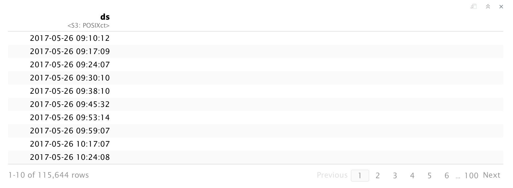
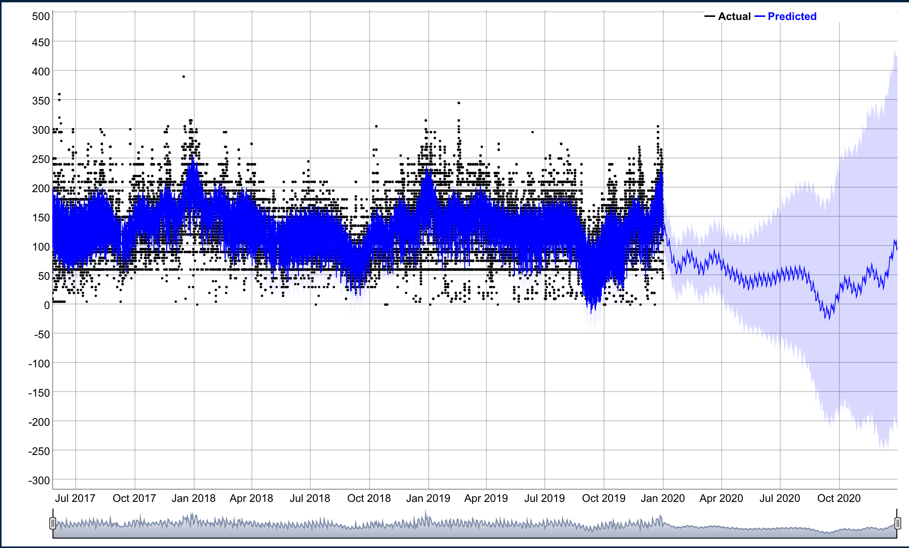

Avatar Flight of Passage is my favorite ride in all of Disney World, I remember waiting close to four hours to ride the ride in December 2017 and I would do it again in a heartbeat. This past December I was able to visit Disney World again and managed to get a hold of some fast passes for the ride which made the experience much better. While I was waiting in line for the ride I wondered what the optimal time to queue up for the ride and wanted to see if I could analyze wait time data.  In this post I'll do some time series forecasting using Facebook's open source [Prophet project](https://facebook.github.io/prophet/) which is used in production for time series forecasting. 

<p align="center">
  
</p>


```{r message=FALSE, warning=FALSE}
library(tidyverse)
library(prophet)
```

### Import data

I was able to get the ride wait time data from the folks at [touringplans.com](https://touringplans.com/walt-disney-world/crowd-calendar#DataSets).
```{r message=FALSE, warning=FALSE}
df <- read_csv(here::here("data_files/flight_of_passage.csv")) 

df
```


### Data cleaning
Prophet requires a datetime column labeled `ds` and numerical `y` column.  We can clean up the data by filtering out missing values and times when the ride was closed indicated by `-999`.
```{r message=FALSE, warning=FALSE}
df2 <- df %>% 
  select(ds = datetime, y = SPOSTMIN,-date,-SACTMIN) %>% 
  filter(!y %in% c(-999) &
           !is.na(y))

df2
```


### Using prophet
We can call the `prophet()` function to run the model fitting API on our data and it returns a model object.
```{r eval=FALSE, include=TRUE}
df_m <- df2 %>%
  prophet()

df_m
```

```{r echo = FALSE, fig.width = 10}
knitr::include_graphics("df_prophet.png")
```

```{r eval=FALSE, include=FALSE}
# write_rds(df_m, "df_m.rds")
df_m <- read_rds(here::here("data_files/df_m.rds"))

df_m
```


### Generate future dates
Next we can use the `make_future_dataframe()` on our `df_m` model  object to create a dataframe containing forecast date data.
```{r eval=FALSE, include=TRUE}
future <- make_future_dataframe(df_m, periods = 365)
head(future)

```

```{r echo = FALSE, fig.width = 10}

```

```{r eval=FALSE, include=FALSE}
# write_rds(future, "future.rds")
future <- read_rds(here::here("data_files/future.rds"))

future
```


### Generating a forecast
The next step is to use `predict()` function to create a forecast of our model of the generated `future` dates.
```{r eval=FALSE, include=TRUE}
forecast <- predict(df_m, future)
head(forecast)
```


```{r eval=FALSE, include=FALSE}
# write_rds(forecast, "forecast.rds")

forecast <- read_rds(here::here("data_files/forecast.rds"))

forecast
```

```{r echo = FALSE, fig.width = 10}
knitr::include_graphics("df_forecast.png")
```

### Plotting
We can use `dyplot.prophet()` to create an interactive dyplot but I have included a static picture here so it loads faster on this site.  We can see that on the Y axis overall that the overall wait time trend appears to be ~120 minutes.  Prophet created a time series forecast as indicated by the blue line and as we expect the error increases as you predict more in the future.  
```{r eval=FALSE, message=FALSE, warning=FALSE, include=TRUE}
FOP_dyplot <- dyplot.prophet(df_m, forecast)

FOP_dyplot
```

```{r fig.width=10, echo = FALSE}

```


```{r eval=FALSE, include=FALSE}
# library(htmlwidgets)
# library(webshot)
# saveWidget(FOP_dyplot, "FOP_dyplot.html", selfcontained = FALSE)
```

### Plotting the components
One of the neatest features of Prophet is the ability to look at different components of the data.  We can use `prophet_plot_components()` to four plots including, overall trends, weekly,yearly, and  daily trends.
```{r eval=FALSE, message=FALSE, warning=FALSE, include=TRUE}
FOP_component_plot <- prophet_plot_components(df_m, forecast)

FOP_component_plot
```

```{r eval=FALSE, include=FALSE}
trend_plot <- FOP_component_plot[[1]]
weekly_trend_plot <- FOP_component_plot[[2]]
yearly_trend_plot <- FOP_component_plot[[3]]
daily_trend_plot <- FOP_component_plot[[4]]

# ggsave(plot = trend_plot, 
#        here::here("/content/post/2020-03-02-avatar-flight-of-passage/fig02_trend_plot.png"),
#        width = 6, height = 3, units = "in", dpi = 600)
# 
# ggsave(plot = weekly_trend_plot, 
#        here::here("/content/post/2020-03-02-avatar-flight-of-passage/fig03_weekly_plot.png"),
#        width = 6, height = 3, units = "in", dpi = 600)
# 
# ggsave(plot = yearly_trend_plot, 
#       here::here("/content/post/2020-03-02-avatar-flight-of-passage/fig04_yearly_plot.png"),
#        width = 6, height = 3, units = "in", dpi = 600)
# 
# ggsave(plot = daily_trend_plot, 
#        here::here("/content/post/2020-03-02-avatar-flight-of-passage/fig05_daily_plot.png"),
#        width = 6, height = 3, units = "in", dpi = 600)
```


We can see in the trend plot that we can confirm that the overall trend is that wait times are quite steady for Avatar Flight of Passage.

```{r echo = FALSE, fig.width = 10}
knitr::include_graphics("fig02_trend_plot.png", dpi = 600)
```

When we look at the weekly plot we can see up to a 10% reduction in wait time  on Wednesdays!
```{r echo = FALSE, fig.width = 10}
knitr::include_graphics("fig03_weekly_plot.png", dpi = 600)
```

Yearly data suggests the best time to ride the ride in September which seems to correspond to the start of school for most students in the US.  I usually go to Disney World around the holidays and as we expect it is definitely one of the busiest times of the year.  It's nice to see that the data reflect what we intuitively think.
```{r echo = FALSE, fig.width = 10}
knitr::include_graphics("fig04_yearly_plot.png", dpi = 600)
```
The hourly level data suggests that getting to Animal Kingdom right when it opens and just before the parks close seem to be the best time to queue up for the ride.  

```{r echo = FALSE, fig.width = 10}
knitr::include_graphics("fig05_daily_plot.png", dpi = 600)
```
   
### TL;DR  


It appears the best time to ride Avatar Flight of Passage is right when the park opens on a Wednesday in September!  If you can't manage to go to Disney's Animal Kingdom during this time, you can still enjoy the beautiful scenery of the World of Pandora while you wait!
```{r echo = FALSE, fig.width = 10}
knitr::include_graphics("featured2.jpeg", dpi = 600)
```


