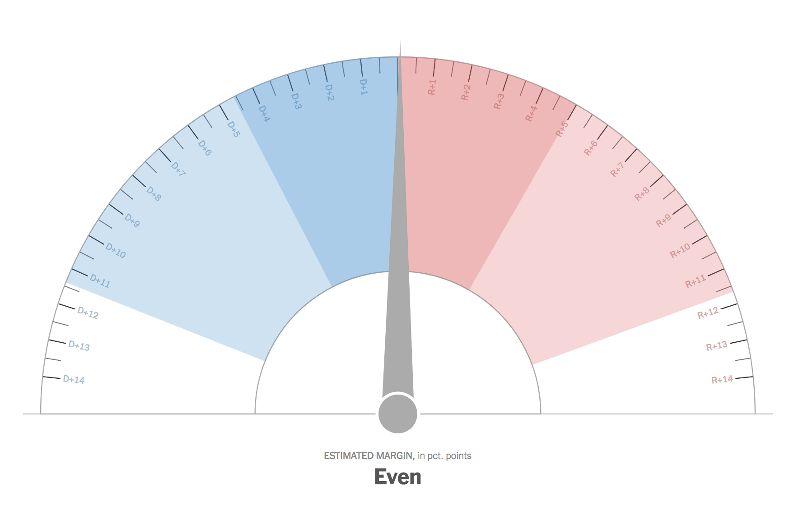
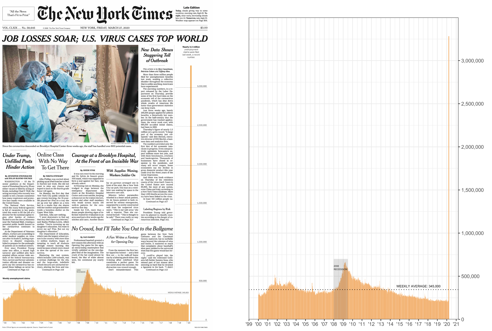

---
title: How to reproduce a NYT graphic
author: Sean Nguyen
date: '2020-03-27'
slug: how-to-reproduce-a-nyt-graphic
categories:
  - Economics
  - R
  - Visualization
tags:
  - Data Visualization
  - NYT
  - ggplot
subtitle: ''
summary: ''
authors: []
featured: yes
image:
  caption: NYT front page
  focal_point: Center
  placement: 2
  preview_only: yes
--- 

Today the New York Times published the striking figure of US unemployment claims in light of the recent COVID-19 pandemic.  I've always been a strong proponent distilling the essence of what I'm trying to convey in my research especially when I generate plots and [ggplot](https://ggplot2.tidyverse.org/) allows me to do just that. When I run workshops I always mention how you can plot nearly anything with ggplot. Let's see if we can put my claim to the test and recreate this incredible plot of the number of unemployment claims. 

```{r echo = FALSE, fig.width = 10}
knitr::include_graphics("NYT_front.jpg", dpi = 600)
```

## NYT graphics
I've always been impressed with the high quality graphics and visualizations since NYT debut of [The Upshot](https://www.nytimes.com/section/upshot) in 2014.  Perhaps the most infamous graphic was the 2016 presidential election forecast needle. 



Some people definitely have strong feelings when the see the needle for election cycles but I still think it's a great thing for the general populace to understanding data and uncertainty.

 


```{r echo=FALSE, warning=FALSE}
blogdown::shortcode('tweet', '940771937613164545')
```


```{r echo=FALSE, warning=FALSE}
blogdown::shortcode('tweet', '973721512619462656')
```

 
 
Regardless of your feelings about the NYT election forecast needle I want to highlight the incredible visualizations that they produce to help readers understand complex information.  This blog post was inspired by [Andrew Heiss](https://twitter.com/andrewheiss/status/1243217997436801026) and today's front page graphic. Let's see if we can reproduce the same graphic with ggplot.


## Getting the data
We can use the [tidyquant package](https://github.com/business-science/tidyquant) to get the ICSA (Initial claims, seasonally adjusted)  economic data from the most recent unemployment claims since the onset of the Coronavirus pandemic. We can use `tq_get()` to select the data that we want starting from 1967.
```{r message=FALSE, warning=FALSE}
library(tidyverse)
library(tidyquant) 
library(lubridate)
library(scales) 


data_raw <- tq_get("ICSA",
                   get = "economic.data",  
                   from = "1967-01-07") 

data_raw
```

##  Data wrangling
We can then get the ICSA data and filter from 2000 and later.  Then we can rename the price to something that makes more sense like `claim_no`.
```{r message=FALSE, warning=FALSE}

claims_no <- data_raw %>% 
  filter(symbol == "ICSA" &
           date >= "2000-01-01") %>% 
  rename(claim_no = price)

claims_no
```


## Generating the plot
I'm going to take you step by step how I recreated the plot so we can see how we can add features with each line of code.
```{r message=FALSE, warning=FALSE}

NYT_plot <- claims_no %>% 
  ggplot(aes(x = date, y = claim_no)) +
  geom_col(fill = "#F4B066") 

NYT_plot
```


## Adding lines and text
We can add text to the plot with the `annotate()` function and create a horizontal dotted line with `geom_hline()`.
```{r message=FALSE, warning=FALSE}

NYT_plot <- NYT_plot +
  annotate("text", x = as.Date("2008-01-01"), y = 6E5, 
           label = "2008\nRECESSION", size = 1.4, hjust = 0 ) +
  geom_hline(yintercept=c(345000), linetype="dotted") +
  annotate("text", x = as.Date("2017-01-01"), y = 3.85E5, 
           label = "WEEKLY AVERAGE: 345,000", size = 2) 

NYT_plot
```

## Adding accents
We can create a separate column that is a little bit thicker than the rest of the data by using `geom_segment()` as well as highlight the 2008 recession by using `annotate()` and  `"rect"` to highlight the time span of the 2008 recession.

```{r message=FALSE, warning=FALSE}
NYT_plot <- NYT_plot +
  geom_segment(aes(x = as.Date("2020-03-21"), xend = as.Date("2020-03-21"),
                   y = 	0, yend = 3283000),color = "#F4B066") +
  annotate("rect", xmin = as.Date("2008-01-01"), xmax = as.Date("2009-07-01"),
           ymin = 0, ymax = 7E5,
  alpha = .2)

NYT_plot
```

### Switching the axis and adjusting labels
Next we can move the y-axis to the right side and make the x-axis drop `20`  and clean it up with `theme_bw()`. We can also add a caption of the source data in the `labs()` argument.
```{r message=FALSE, warning=FALSE}

NYT_plot <- NYT_plot +
  scale_y_continuous(position = "right",
                     labels = comma,
                     limits = c(0, 3.5E6),
                     breaks = seq(0,3E6, 5E5),
                     expand = c(0, 0)) +
  scale_x_date(date_labels = "\'%y", date_breaks = "1 year") +
  labs(x = "", y = "",
       caption = "Source: Initial weekly unemployment claims (ICSA))") +
  theme_bw()

NYT_plot
```

## Putting it all together
Here's the finalized code of all the things in one code chunk.  It's really nice to be able get the same data as the NYT and harvest, clean, and plot the data all in R.  Obviously things look nicer when you port things in different tools such as D3.js, photoshop, and illustrator but my point was to highlight the power of using open source software to achieve great results!
```{r message=FALSE, warning=FALSE}

NYT_plot <- claims_no %>% 
  ggplot(aes(x = date, y = claim_no)) +
  geom_col(fill = "#F4B066") +
  annotate("text", x = as.Date("2008-01-01"), y = 6E5, 
           label = "2008\nRECESSION", size = 1.4, hjust = 0 ) +
  geom_hline(yintercept=c(345000), linetype="dotted") +
  annotate("text", x = as.Date("2017-01-01"), y = 3.85E5, 
           label = "WEEKLY AVERAGE: 345,000", size = 2) +
  geom_segment(aes(x = as.Date("2020-03-21"), xend = as.Date("2020-03-21"),
                   y = 	0, yend = 3283000),color = "#F4B066") +
  annotate("rect", xmin = as.Date("2008-01-01"), xmax = as.Date("2009-07-01"),
           ymin = 0, ymax = 7E5,
  alpha = .2) +
  scale_y_continuous(position = "right",
                     labels = comma,
                     limits = c(0, 3.5E6),
                     breaks = seq(0,3E6, 5E5),
                     expand = c(0, 0)) +
  scale_x_date(date_labels = "\'%y", date_breaks = "1 year") +
  labs(x = "", y = "",
       caption = "Source: Initial weekly unemployment claims (ICSA))") +
  theme_bw()

NYT_plot

# ggsave(plot = NYT_plot, "NYT_plot.png", 
#        height = 8, width = 6, units = "in", dpi = 600)
```

## TL;DR
We can recreate plots like the NYT graphics team using ggplot!



Make sure you stay safe, wash your hands, and stay home during this COVID-19 pandemic!


